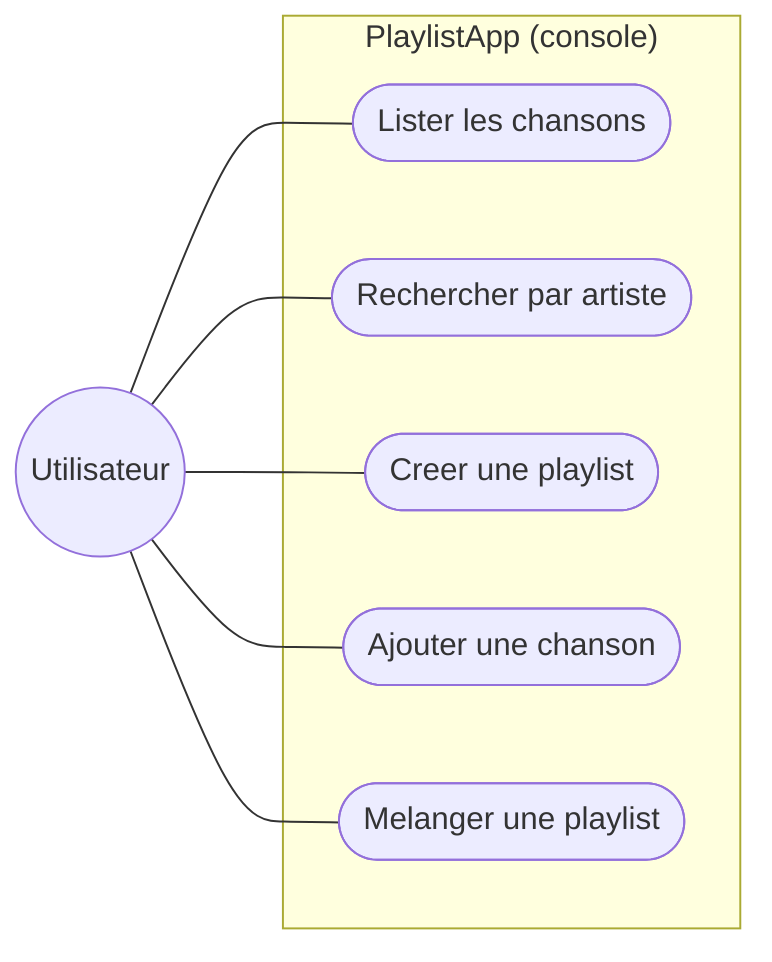
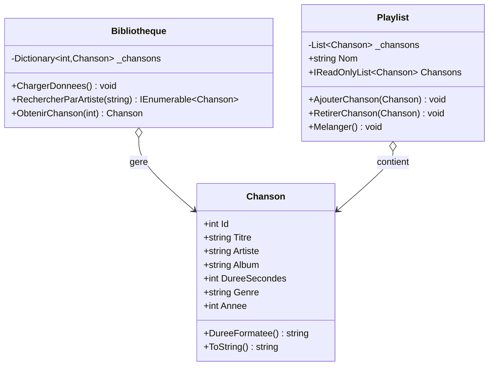
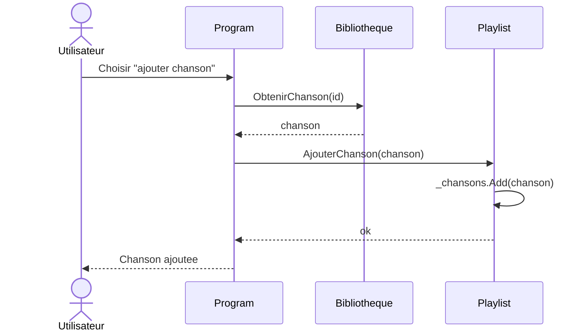
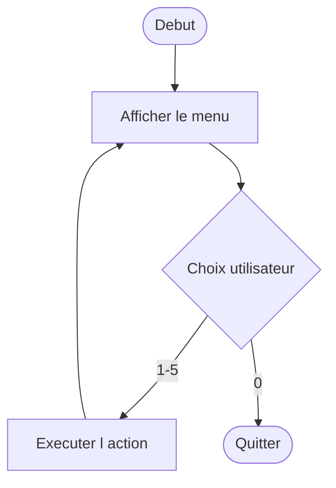
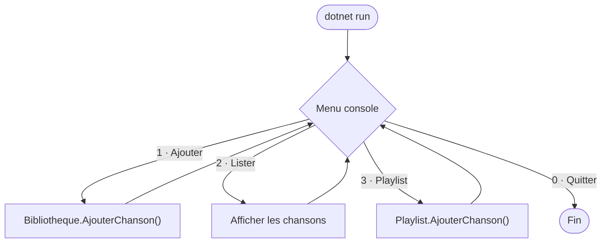
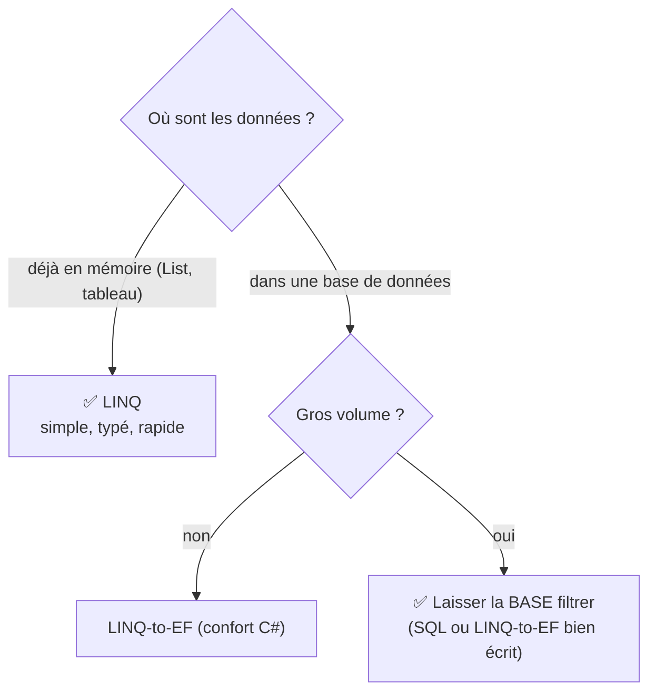

# 📘 TP1 — Application console & Programmation Orientée Objet

> **Module :** PlaylistApp (1/3) · **Durée : 4h**

> 🎓 **Concepts associés** (explication + auto-évaluation) : [POO](../cours/poo.md) · [Collections](../cours/collections.md) · [LINQ](../cours/linq.md)

> **Démarche :** partir d'un exemple fonctionnel → le comprendre → se l'approprier par des modifications.

---

> 🏛️ **Enjeu d'architecture** — Ce TP pose les **fondations objet** (encapsulation, choix des structures de données). Bien les poser conditionne la lisibilité et l'évolutivité de toute la suite. Arbitrage récurrent : **structurer proprement** vs **aller au plus vite**.

## 1. Objectifs pédagogiques

À la fin de ce TP, vous serez capable de :

| # | Compétence visée | Comment vous la prouverez |
|---|---|---|
| O1 | Lire et comprendre une classe C# (POO) | Vous expliquerez le rôle de chaque classe |
| O2 | Manipuler des collections (`List<T>`, `Dictionary<K,V>`) | Vous ajouterez une méthode de tri |
| O3 | Écrire une requête LINQ | Vous créerez une nouvelle recherche |
| O4 | Faire évoluer un code existant sans le casser | Vos modifications compileront et tourneront |
| O5 | Conteneuriser avec Docker | Vous lancerez l'app dans un conteneur |

**Compétence BTS :** SLAM1 (concevoir et développer une solution applicative).
**Prérequis :** notions de base de programmation. Aucune installation locale (tout se fait dans GitHub Codespaces).

---

## 2. Contexte métier

> Une médiathèque municipale veut un premier outil interne pour gérer ses playlists musicales : lister des morceaux, les ranger dans des playlists, faire des recherches. On commence par une **application console** simple, en mémoire. Les TP suivants ajouteront une base de données (TP2) puis une API web (TP3).

Vous ne partez **pas d'une page blanche** : un exemple fonctionnel vous est fourni. Votre travail est de le **comprendre** puis de l'**enrichir**.

---

## 3. Modélisation UML

> Avant de plonger dans le code, voici les 4 vues UML qui décrivent ce TP. Sur GitHub, ces diagrammes s'affichent automatiquement.

### Diagramme de cas d'utilisation
Ce que l'utilisateur peut faire avec l'application console.



### Diagramme de classes
La structure du code : trois classes et leurs relations.



### Diagramme de séquence — « ajouter une chanson à une playlist »
L'enchaînement des appels entre objets pour cette action.



### Diagramme d'activité — la boucle du menu
Le flux de contrôle de l'application.



---

## 4. Mise en place de l'environnement — pas à pas

> Suivez chaque étape dans l'ordre. À chaque étape, un **✅ Résultat attendu** vous permet de vérifier que tout va bien avant de continuer.

### Étape 1 — Créer votre dépôt depuis le template
1. Ouvrez le dépôt du cours dans votre navigateur.
2. Cliquez sur le bouton vert **`Use this template`** → **`Create a new repository`**.
3. Nommez-le `playlist-csharp-VOTRENOM`, laissez-le en **Public**, puis **`Create repository`**.

✅ **Résultat attendu :** vous êtes sur la page de *votre* dépôt, à l'adresse `https://github.com/VOTREUSER/playlist-csharp-VOTRENOM`.

### Étape 2 — Ouvrir l'environnement de développement
1. Sur votre dépôt : bouton **`Code`** → onglet **`Codespaces`** → **`Create codespace on main`**.
2. Patientez ~2 minutes (construction de l'environnement).

✅ **Résultat attendu :** VS Code s'ouvre dans votre navigateur, avec l'arborescence du projet à gauche.

### Étape 3 — Vérifier les outils
Dans le terminal intégré (menu `Terminal` → `New Terminal`), tapez :
```bash
dotnet --version
```
✅ **Résultat attendu :** une version commençant par `10.0` s'affiche.

### Étape 4 — Lancer l'application fournie
```bash
cd PlaylistApp
dotnet run
```
✅ **Résultat attendu :** un menu s'affiche dans le terminal :
```
╔══════════════════════════════════════════════╗
║        🎵  PlaylistApp  🎵                  ║
╚══════════════════════════════════════════════╝
══ MENU PRINCIPAL ══════════════════════════════
   1. Lister toutes les chansons
   ...
▶  Votre choix :
```

### Étape 5 — Tester quelques fonctions
- Tapez `1` puis `Entrée` → la liste des chansons s'affiche.
- Tapez `2` → recherchez « Queen ».
- Tapez `0` → quittez.

✅ **Résultat attendu :** vous avez vu des données de démonstration s'afficher. **L'exemple fonctionne : vous pouvez maintenant l'étudier.**

---

## 5. Comprendre l'exemple fourni

> 🔁 **Vue d'ensemble de l'exécution** — la boucle de menu de `Program.cs` orchestre `Bibliotheque` et `Playlist` :




> Avant de modifier, on lit. Voici l'architecture et le rôle de chaque fichier.

```
PlaylistApp/
├── Models/
│   ├── Chanson.cs          ← Une chanson (titre, artiste, durée…)
│   └── Playlist.cs      ← Une playlist = une liste ordonnée de chansons
├── Services/
│   └── Bibliotheque.cs  ← Le "cerveau" : gère toutes les chansons et playlists
└── Program.cs           ← Le menu et l'interaction avec l'utilisateur
```

### Lecture guidée — dans cet ordre

**1. `Models/Chanson.cs`** — la brique de base.
Ouvrez le fichier. Repérez :
- Les **propriétés** (`Title`, `Artist`, `Duration`…) : ce sont les données d'une chanson.
- La **méthode** `DureeFormatee()` : transforme 354 secondes en `05:54`.
- `ToString()` : définit comment une chanson s'affiche en texte.

> 🧠 **Question de compréhension :** pourquoi `Duration` est un `int` (secondes) et pas une chaîne « 5:54 » ? *(Réponse : pour pouvoir faire des calculs — additionner des durées, trier.)*

**2. `Models/Playlist.cs`** — un conteneur de chansons.
Repérez :
- Le champ privé `_chansons` de type `List<Chanson>` : la collection ordonnée.
- La propriété `Songs` en `IReadOnlyList` : on peut **lire** la liste de l'extérieur, mais pas la modifier directement (c'est l'**encapsulation**).
- Les méthodes `AjouterChanson`, `RetirerChanson`, `Shuffle`.

**3. `Services/Bibliotheque.cs`** — le service central.
Repérez :
- `Dictionary<int, Chanson>` : range les chansons par identifiant pour un accès rapide.
- La méthode `SeedData()` : crée les données de démonstration au démarrage.
- Les méthodes de recherche utilisant **LINQ** (`.Where()`, `.OrderBy()`).

**4. `Program.cs`** — le point d'entrée.
C'est la boucle du menu qui appelle les méthodes ci-dessus.

> 📌 **Schéma mental à retenir :**
> `Program.cs` (interface) → `Bibliotheque` (logique) → `Chanson` / `Playlist` (données)

---

## 6. S'approprier le code par la modification

> **C'est le cœur du TP.** Vous allez faire évoluer l'exemple en 3 paliers. Chaque modification suit le même rituel : **Objectif → Démarche → Vérification → Indice**. La solution complète n'est pas donnée : à vous de chercher (c'est ça, s'approprier).

### 🟢 Modification 1 (guidée) — Ajouter une note aux chansons

**🎯 Objectif :** chaque chanson pourra avoir une note de 1 à 5 étoiles.

**📝 Démarche :**
1. Dans `Models/Chanson.cs`, ajoutez une propriété `Note` de type `int`.
2. Donnez-lui une valeur par défaut de `3`.
3. Modifiez `ToString()` pour afficher la note (ex. `★3`).

**🔍 Vérification :** relancez `dotnet run`, listez les chansons → la note apparaît.

**💡 Indice :** une propriété s'écrit `public int Note { get; set; } = 3;`. Pour l'affichage, ajoutez `★{Note}` dans la chaîne du `ToString()`.

---

### 🟡 Modification 2 (semi-guidée) — Trier une playlist par durée

**🎯 Objectif :** ajouter une option « trier la playlist par durée » dans le menu.

**📝 Démarche :**
1. Dans `Models/Playlist.cs`, ajoutez une méthode `SortByDuration()` qui réordonne `_chansons`.
2. Dans `Program.cs`, ajoutez une entrée de menu qui appelle cette méthode.

**🔍 Vérification :** créez une playlist, ajoutez-y des chansons de durées différentes, triez → l'ordre change du plus court au plus long.

**💡 Indice :** la classe `List<T>` a une méthode `.Sort(...)`. Comparez deux durées avec `a.Duration.CompareTo(b.Duration)`.

---

### 🔴 Modification 3 (autonome) — Recherche par genre musical

**🎯 Objectif :** permettre de chercher toutes les chansons d'un genre donné (Rock, Pop…).

**📝 Démarche (à vous de la définir) :** inspirez-vous de la recherche par artiste qui existe déjà dans `Bibliotheque.cs`.

**🔍 Vérification :** chercher « Rock » renvoie uniquement les chansons de genre Rock.

**💡 Indice :** LINQ `.Where(s => s.Genre == genre)`. Pensez à ajouter l'entrée de menu correspondante.

---

## 7. Conteneuriser avec Docker

**🎯 Objectif :** faire tourner votre application dans un conteneur, comme en entreprise.

```bash
# Depuis le dossier PlaylistApp
docker build -t playlist-app .
docker run -it playlist-app
```
✅ **Résultat attendu :** le même menu s'affiche, mais cette fois l'app tourne **dans un conteneur isolé**.

> 🧠 **Question :** ouvrez le `Dockerfile`. Pourquoi y a-t-il deux étapes (`build` puis `runtime`) ? *(Réponse : l'image finale ne contient que ce qui est nécessaire pour exécuter, pas tout le SDK de compilation → image plus légère.)*

---

## 8. Validation finale — checklist

Cochez dans votre README au fur et à mesure :
- [ ] L'application démarre (`dotnet run`)
- [ ] **Modification 1** : la note s'affiche sur les chansons
- [ ] **Modification 2** : le tri par durée fonctionne
- [ ] **Modification 3** : la recherche par genre fonctionne
- [ ] `docker build` réussit et l'app tourne dans le conteneur
- [ ] J'ai fait **au moins 3 commits** avec des messages clairs

> Sauvegardez votre travail régulièrement :
> ```bash
> git add .
> git commit -m "feat: ajout de la note sur les chansons"
> git push
> ```

---

## 9. Pour aller plus loin (optionnel)

- Ajoutez une méthode `GetTopRatedSongs(int n)` qui renvoie les `n` chansons les mieux notées.
- Affichez la durée totale d'une playlist en heures/minutes.
- Empêchez d'ajouter deux fois la même chanson à une playlist.

---

## 🆚 SQL vs LINQ : comparatif, performance et choix

Même question — « les 3 chansons de rock les mieux notées » — exprimée de deux façons :

| | SQL (langage de la base) | LINQ (intégré à C#) |
|---|---|---|
| Écriture | `SELECT Titre FROM Chansons WHERE Genre='Rock' ORDER BY Note DESC LIMIT 3;` | `chansons.Where(c => c.Genre=="Rock").OrderByDescending(c => c.Note).Take(3)` |
| S'exécute | dans le moteur de base de données | dans votre programme C# |
| Vérifié | à l'exécution (chaîne de texte) | à la **compilation** (typé) |
| Sur quoi | des tables | des objets en mémoire (`List`, tableau…) |

### ⏱️ Mesurer le temps d'affichage

Encadrez la requête avec un `Stopwatch` pour voir le temps réel :

```csharp
var sw = System.Diagnostics.Stopwatch.StartNew();
var top = chansons.Where(c => c.Genre == "Rock")
                  .OrderByDescending(c => c.Note)
                  .Take(3)
                  .ToList();
sw.Stop();
Console.WriteLine($"⏱️ LINQ : {sw.Elapsed.TotalMilliseconds:F3} ms ({top.Count} résultats)");
```

> 📏 **Ordre de grandeur** (à confirmer sur votre machine, ça dépend du volume) :
>
> | Volume | LINQ en mémoire | SQL (base indexée) |
> |---|---|---|
> | ~100 chansons | < 1 ms | quelques ms (réseau + moteur) |
> | ~1 000 000 chansons | dizaines de ms (tout chargé en RAM) | quelques ms (l'index trie) |
>
> 👉 Sur **petit volume déjà en mémoire**, LINQ gagne (aucun aller-retour base). Sur **gros volume stocké**, laisser la **base** filtrer/trier ne rapatrie que 3 lignes au lieu d'un million : bien plus rapide.

### 🧭 Choisir selon l'usage



| Situation | Préférez | Pourquoi |
|---|---|---|
| Collection déjà chargée en C# | **LINQ** | pas d'aller-retour base, typé, lisible |
| Données en base, petit volume | **LINQ-to-EF** | confort C#, EF traduit en SQL |
| Données en base, gros volume indexé | **SQL** (ou LINQ-to-EF soigné) | le moteur filtre/trie, on ne rapatrie que l'utile |
| Requête partagée avec d'autres outils | **SQL** | indépendant du langage |

### ✅ Mini auto-évaluation

**Q1.** Vous avez une `List<Chanson>` déjà en mémoire. SQL ou LINQ ?
<details><summary>▸ Voir la réponse</summary>

**LINQ** : les données sont déjà en RAM, inutile de passer par une base — plus simple et typé.
</details>

**Q2.** Une table de 5 millions de lignes ; vous voulez les 10 meilleures. Pourquoi ne pas tout charger en mémoire pour trier en LINQ ?
<details><summary>▸ Voir la réponse</summary>

Charger 5 M de lignes coûte énormément (RAM + temps). On laisse la **base** trier via son **index** et ne renvoyer que 10 lignes (`ORDER BY … LIMIT 10`). LINQ-to-EF génère ce SQL pour vous.
</details>

**Q3.** Un avantage de LINQ qu'une requête SQL en chaîne de texte n'a pas ?
<details><summary>▸ Voir la réponse</summary>

LINQ est **vérifié à la compilation** (types, noms de propriétés) : une faute est détectée avant l'exécution, contrairement à une chaîne SQL dont l'erreur n'apparaît qu'au lancement.
</details>

---

## 10. Dépannage

| Problème | Solution |
|---|---|
| `dotnet : command not found` | Reconstruisez le Codespace : `Ctrl+Shift+P` → *Rebuild Container* |
| Le menu ne réagit pas | Vérifiez que vous tapez le numéro **puis** `Entrée` |
| `docker : permission denied` | Attendez 30s après l'ouverture du Codespace puis réessayez |
| Mes modifications ne s'affichent pas | Avez-vous **enregistré** (`Ctrl+S`) puis relancé `dotnet run` ? |

---

➡️ **TP suivant :** [TP2 — Entity Framework Core & base de données](../PlaylistAppEF/TP2_GUIDE.md)
