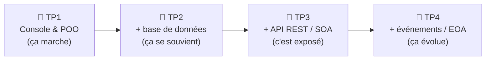

# 🎵 PlaylistApp

<div align="center">

[](https://github.com/ggaillard/playlist-csharp/actions/workflows/tp1-build.yml)
[](https://github.com/ggaillard/playlist-csharp/actions/workflows/tp2-tests.yml)
[](https://github.com/ggaillard/playlist-csharp/actions/workflows/tp3-api.yml)
[](https://ggaillard.github.io/playlist-csharp)

[](https://codespaces.new/ggaillard/playlist-csharp?quickstart=1)

**Support de cours C# / .NET 10 · 2025-2026**

</div>

---

## 🚀 Par où commencer ?

### 👉 Un seul point de départ : **[Ouvrir le Parcours pédagogique →](PARCOURS_TP.md)**

Tout est là, dans l'ordre : la **méthode**, la **mise en route**, les **4 TP** et les **productions à rendre**. Suivez-le de haut en bas, sans vous disperser.

## 🎯 À quoi sert ce dépôt ?

Ce dépôt est le **support de cours complet** pour apprendre C# et .NET 10 à travers le développement d'une application de gestion de playlists musicales. Il contient 4 TP progressifs, tous exécutables **directement dans votre navigateur** grâce à GitHub Codespaces — **aucune installation locale requise**.

### 🗺️ Votre parcours en un coup d'œil



---

## 🚦 Les 3 étapes de mise en route (détaillées dans le [Parcours](PARCOURS_TP.md))

### 1️⃣ Créer votre propre dépôt

> **Ne pas fork !** Utilisez le bouton "Use this template" pour avoir votre propre copie propre.

```
Cliquer sur : [ Use this template ] → [ Create a new repository ]
Nom suggéré  : playlist-csharp-VOTRE_NOM
Visibilité   : Public (obligatoire pour GitHub Pages gratuit)
```

### 2️⃣ Ouvrir dans GitHub Codespaces

```
Votre dépôt → [ Code ] → [ Codespaces ] → [ Create codespace on main ]
```

Attendez ~2 minutes → VS Code s'ouvre dans votre navigateur avec tout pré-installé :
- .NET 10 SDK · dotnet-ef · Docker · Git
- Extensions VS Code : C# Dev Kit, Docker, SQLite Viewer, REST Client

### 3️⃣ Suivre les TP dans l'ordre

```bash
# TP1 – Application console (collections C#)
cd PlaylistApp && dotnet run

# TP2 – Entity Framework Core + SQLite
cd PlaylistAppEF && dotnet run
dotnet test ../PlaylistAppEF.Tests/     ← vérifiez votre progression

# TP3 – API REST (architecture SOA)
cd PlaylistAppAPI && dotnet run
# → Swagger disponible sur http://localhost:5000

# TP4 – Architecture événementielle (EOA)
dotnet test ../PlaylistAppAPI.Tests/ --filter EventBusTests   # 5 tests EOA
```

---

## 📁 Architecture du dépôt

```
playlist-csharp/
│
├── 🎯 docs/index.html         TABLEAU DE BORD de progression (publié sur GitHub Pages)
├── 📋 PROGRESSION.md          Checklist versionnée (à committer)
├── 🗺️  PARCOURS_TP.md          La méthode pédagogique + index des missions
├── 🎓 cours/                  Concepts de cours + auto-évaluations
├── 📖 GUIDE_ETUDIANT.md       Mise en route détaillée + dépannage
│
├── 📘 PlaylistApp/            TP1 — Console & POO
│   ├── TP1_GUIDE.md               ← fiche du TP (objectifs, UML, missions)
│   ├── Models/  Services/  Program.cs  Dockerfile
│
├── 📗 PlaylistAppEF/          TP2 — Entity Framework Core + SQLite
│   ├── TP2_GUIDE.md
│   ├── Data/  Models/  Repositories/  Migrations/  Program.cs
├── 📗 PlaylistAppEF.Tests/        31 tests (xUnit)
│
├── 📕 PlaylistAppAPI/         TP3 & TP4 — API REST (SOA) puis Événements (EOA)
│   ├── TP3_GUIDE.md               ← TP3 : API REST & architecture SOA
│   ├── TP4_GUIDE.md               ← TP4 : architecture événementielle EOA
│   ├── Controllers/  Events/  Program.cs
├── 📕 PlaylistAppAPI.Tests/       13 tests (8 intégration + 5 EOA)
│
├── .devcontainer/            Environnement Codespaces (zéro installation)
├── .github/workflows/        CI/CD : build + tests + déploiement Pages
└── .gitpod.yml               Alternative Gitpod
```

> **Tout est dans le dépôt** : pas de document à télécharger. Les fiches de TP, la méthode, le suivi de progression et le code vivent ensemble et restent versionnés.


## 📦 Productions à rendre

Pour chaque TP, le rendu tient dans votre dépôt : **du code qui compile, des tests verts, des commits réguliers**.

| TP | À rendre | Preuve auto (badge CI) |
|---|---|---|
| 📘 TP1 | 3 missions committées · app console qui se lance | TP1 – Build ✅ |
| 📗 TP2 | migration appliquée · entité Artiste (1-N) | TP2 – Tests ✅ (31 tests) |
| 📕 TP3 | API + Swagger · endpoints testés | TP3 – API ✅ (8 tests) |
| 🎏 TP4 | 3 modifications EOA · événements dans les logs | 5 tests EOA ✅ |

Détail complet et critères : **[Parcours → Productions à rendre](PARCOURS_TP.md#-productions-à-rendre-par-tp)**.

---

## 📊 Suivre ma progression

Deux outils complémentaires, **entièrement dans le dépôt** :

| Outil | Usage | Où |
|---|---|---|
| 🎯 **Tableau de bord interactif** | Cocher mes missions, voir mes barres de progression, exporter | [Page GitHub Pages](https://ggaillard.github.io/playlist-csharp) |
| 📋 **PROGRESSION.md** | Checklist versionnée, visible par l'enseignant | [PROGRESSION.md](PROGRESSION.md) |

Le tableau de bord sauvegarde votre avancement dans le navigateur. Quand vous voulez le partager (rendu, point d'étape), cliquez « Exporter », collez le résultat dans `PROGRESSION.md`, et committez.


## 🔗 Ressources

| Ressource | Lien |
|---|---|
| Documentation complète | [GitHub Pages du cours](https://ggaillard.github.io/playlist-csharp) |
| Référence GitHub (sqlite-dotnet-core) | [jasonsturges/sqlite-dotnet-core](https://github.com/jasonsturges/sqlite-dotnet-core) |
| Documentation EF Core | [learn.microsoft.com/ef/core](https://learn.microsoft.com/fr-fr/ef/core/) |
| Documentation ASP.NET Core | [learn.microsoft.com/aspnet/core](https://learn.microsoft.com/fr-fr/aspnet/core/) |
| GitHub Codespaces | [github.com/codespaces](https://github.com/codespaces) |

---

## ❓ Besoin d'aide ?

Ouvrez une [issue avec le template "Question"](../../issues/new?template=question.yml) en précisant :
- Le TP concerné (TP1 / TP2 / TP3)
- Le message d'erreur complet
- La commande que vous avez tapée

---

<div align="center">
<sub>Support de cours · 2025-2026</sub>
</div>
