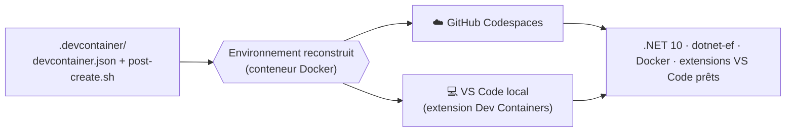

# 🚀 TP0 — Mettre en place l'environnement

> **Module :** PlaylistApp (0/4) · **Durée : ~30 min** · Stack : .NET 10 · C# 14
>
> 🎯 **Objectif :** faire tourner l'application **avant tout codage**, et comprendre comment l'environnement est préparé. Deux voies au choix : **Codespaces** (rien à installer) ou **VS Code en local**.

> 🔑 **Icônes :** ✍️ à faire · ✅ valider · 🐳 Docker.

---

> 🏛️ **Enjeu d'architecture** — Un environnement **reproductible** (identique pour tout le monde, fini le « ça marche chez moi ») est la fondation d'un projet sérieux. Le dossier `.devcontainer` **décrit** l'environnement ; Codespaces (cloud) ou VS Code (local) le **recréent à l'identique**.

## 1. Objectifs

- Lancer l'application console (TP1) dans un environnement prêt à l'emploi.
- Comprendre le rôle du dossier `.devcontainer`.
- Choisir sa voie : 🟢 Codespaces (zéro installation) ou 🟡 VS Code local.

## 2. Comprendre le dossier `.devcontainer`

Un **Dev Container** est un environnement de développement **décrit par du code**, dans le dossier `.devcontainer/`. Le même descriptif sert dans le cloud comme en local :



> 🗺️ **Lire l'organigramme** : un **rectangle** = une étape, un **losange** = l'environnement produit. Le même `.devcontainer` donne le **même environnement**, en cloud ou en local.

Deux fichiers clés :

| Fichier | Rôle |
|---|---|
| `.devcontainer/devcontainer.json` | **Décrit** l'environnement : image .NET 10, fonctionnalités (Docker, Git), **extensions VS Code** (C# Dev Kit, Docker, SQLite Viewer, REST Client), ports transférés (5000/5001) |
| `.devcontainer/post-create.sh` | **Script lancé une seule fois** après création : installe `dotnet-ef`, restaure les paquets NuGet, prépare le dossier de données SQLite |

> 🧠 Résultat : vous ouvrez le projet et **tout est déjà installé** — fini « installez d'abord .NET, puis EF Core, puis Docker… ».

## 3. ✍️ Voie A — GitHub Codespaces (recommandé · zéro installation)

1. Sur la page de votre dépôt : **Code → Codespaces → Create codespace on main**.
2. Patientez ~2 min : VS Code s'ouvre **dans le navigateur**, l'environnement se construit depuis le `.devcontainer`.
3. Le terminal est prêt ; .NET 10 et Docker sont disponibles.

> 💡 Rien à installer sur votre machine — idéal pour démarrer tout de suite.

## 4. ✍️ Voie B — En local avec VS Code

**Prérequis :** [VS Code](https://code.visualstudio.com/), [Docker Desktop](https://www.docker.com/products/docker-desktop/) et l'extension **Dev Containers** (`ms-vscode-remote.remote-containers`).

1. Clonez votre dépôt, puis ouvrez le dossier dans VS Code.
2. VS Code propose **« Reopen in Container »** (ou `F1` → *Dev Containers: Reopen in Container*).
3. Le conteneur se construit depuis le `.devcontainer` : **même environnement** qu'en Codespaces.

> 🐳 Docker Desktop doit être lancé. (Sans Docker, vous pouvez installer le **SDK .NET 10** directement, mais le Dev Container reste recommandé : identique pour tous.)

## 5. ✍️ Lancer l'application

```bash
cd PlaylistApp
dotnet run
```

Le **menu de l'application console** s'affiche → l'environnement fonctionne. 🎉

## 6. ✅ Validation finale — checklist

- [ ] Mon environnement est prêt (Codespaces **ou** Dev Container local)
- [ ] `dotnet run` affiche le menu de l'application
- [ ] Je sais à quoi sert le dossier `.devcontainer` (décrire un environnement reproductible)
- [ ] 🎓 J'ai coché mes missions dans `PROGRESSION.md`

## 7. Dépannage

| Problème | Solution |
|---|---|
| `dotnet : command not found` | Reconstruisez l'environnement : `F1` → *Rebuild Container* (ou recréez le Codespace) |
| Docker ne démarre pas (local) | Lancez **Docker Desktop** avant d'ouvrir le conteneur |
| 1re construction longue | Normal : l'image se télécharge une fois, puis elle est mise en cache |

---

➡️ **TP suivant :** [TP1 — Console & POO](PlaylistApp/TP1_GUIDE.md)
🧭 **[Retour au parcours](PARCOURS_TP.md)**
