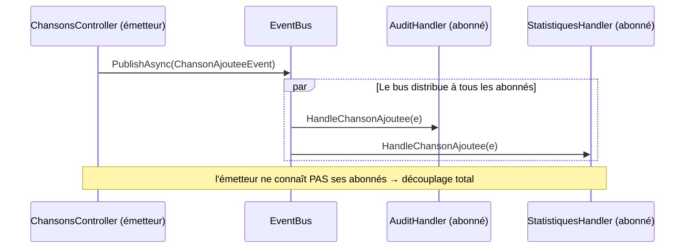
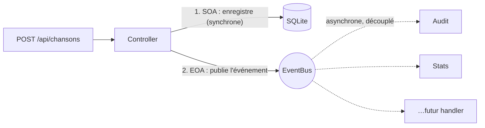

# 🎏 Concept — Événements et publish/subscribe (EOA)

> **TP concerné :** TP4 · **Temps de lecture :** 10 min

---

## 1. Le problème

Quand on crée une chanson, on veut peut-être journaliser, mettre à jour des stats, notifier… Tout mettre dans le Controller le rend énorme et fragile : c'est le **couplage fort**.

## 2. L'idée : annoncer au lieu d'ordonner

L'**EOA** (*Event-Oriented Architecture*) renverse la logique : au lieu d'ordonner chaque action, on **publie un événement** (« chanson ajoutée »), et **ceux que ça intéresse réagissent**.

> 📣 **Analogie de la gare :** le haut-parleur annonce un train. Il ne sait pas qui écoute. Les voyageurs concernés réagissent ; les autres ignorent.

## 3. Les 3 rôles (publish/subscribe)

| Rôle | Qui | Fait |
|---|---|---|
| Émetteur | Controller | publie l'événement |
| Bus | `EventBus` | distribue aux abonnés |
| Abonnés | `AuditHandler`, `StatistiquesHandler` | réagissent |

Pour ajouter un comportement (ex. un e-mail), on crée un handler et on l'abonne — **sans toucher** au Controller.

## 4. SOA et EOA se complètent

| | SOA | EOA |
|---|---|---|
| Logique | « fais et réponds » | « ceci est arrivé, réagissez » |
| Couplage | direct | découplé |
| Moment | synchrone | asynchrone |

> ⚙️ **Passage à l'échelle :** ici le bus est *en mémoire*. En production, on remplace `InMemoryEventBus` par un vrai courtier de messages (**Kafka**, **RabbitMQ**) sans changer la logique des émetteurs ni des abonnés — c'est le même contrat publish/subscribe.

---

## 5. Auto-évaluation

**Q1.** Quel problème l'EOA résout-elle ?

▸ Voir la réponse

Le **couplage fort** : éviter que le code émetteur (le Controller) connaisse et appelle directement tous les effets de bord (audit, stats, notifications). On découple via des événements.

**Q2.** Citez les trois rôles du patron publish/subscribe.

▸ Voir la réponse

L'**émetteur** (publie), le **bus** (distribue), les **abonnés/handlers** (réagissent).

**Q3.** Pour ajouter une notification par e-mail, doit-on modifier le Controller ?

▸ Voir la réponse

Non. On crée un **nouveau handler** et on l'**abonne** à l'événement. Le Controller reste inchangé : c'est tout l'intérêt du découplage.

**Q4.** SOA et EOA sont-elles concurrentes ?

▸ Voir la réponse

Non, **complémentaires**. On enregistre la chanson en SOA (synchrone), puis on publie un événement en EOA pour les effets de bord (asynchrone, découplé).

---

✅ Cochez ce concept dans le [tableau de bord](https://ggaillard.github.io/playlist-csharp).
⬅️ [Retour aux concepts](README.md)
