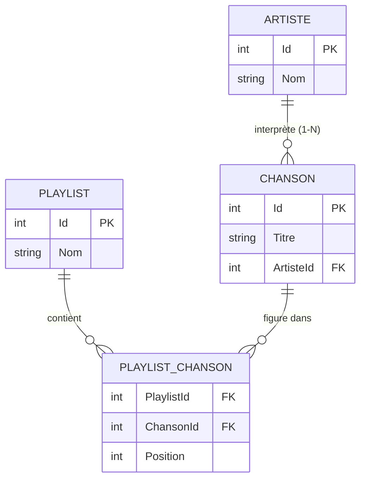

# 🔗 Concept — Les relations entre entités (1-N, N-N)

> **TP concerné :** TP2 · **Temps de lecture :** 8 min

---

## 1. L'idée

Les données du monde réel sont **liées** : un artiste a plusieurs chansons, une playlist contient plusieurs chansons. On modélise ces liens par des **relations**.

## 2. Le modèle de données du projet

Les symboles `||` (un) et `o{` (plusieurs) se lisent : un `ARTISTE` est lié à **plusieurs** `CHANSON`.

## 3. Relation un-à-plusieurs (1-N)

Un artiste → plusieurs chansons, mais une chanson → un seul artiste. En base, la table `Chansons` porte une **clé étrangère** `ArtisteId` qui pointe vers `Artiste.Id`.

## 4. Relation plusieurs-à-plusieurs (N-N)

Une playlist contient plusieurs chansons **et** une chanson peut être dans plusieurs playlists. On ne peut pas relier directement : on crée une **table de liaison** `PlaylistChanson` qui contient les deux clés étrangères (`PlaylistId`, `ChansonId`) et souvent un ordre (`Position`).

> 🧠 La table de liaison **décompose** un N-N en deux relations 1-N. C'est **la** solution standard du référentiel BTS (MLD).

---

## 🏛️ Le point de vue de l'architecte

**Enjeu :** modéliser fidèlement le métier tout en garantissant l'**intégrité** des données et des requêtes efficaces.

| ✅ Avantages | ⚠️ Inconvénients / limites |
|---|---|
| Intégrité référentielle (clés étrangères) | Modèle plus complexe à concevoir |
| Pas de duplication de données | Les jointures ont un coût |
| Requêtes riches (regrouper, filtrer, joindre) | Le chargement (`Include`) doit être maîtrisé |

**Le choix :** **normaliser** (relations) par défaut ; **dénormaliser** ponctuellement (copier une donnée) seulement pour accélérer des lectures critiques.

## 5. Auto-évaluation

**Q1.** Donnez un exemple de relation 1-N dans le projet.

▸ Voir la réponse

Un **artiste** possède plusieurs **chansons**, mais chaque chanson n'a qu'un artiste. (Ou : une playlist a plusieurs entrées d'ordre.)

**Q2.** Comment modélise-t-on une relation N-N ?

▸ Voir la réponse

Avec une **table de liaison** (ici `PlaylistChanson`) qui porte les deux clés étrangères (`PlaylistId` et `ChansonId`). Elle relie les deux tables en décomposant le N-N en deux 1-N.

**Q3.** Que contient en général la table de liaison en plus des deux clés ?

▸ Voir la réponse

Souvent des données propres à l'association, comme la **position** de la chanson dans la playlist, ou une date d'ajout.

---

✅ Cochez ce concept dans le [tableau de bord](https://ggaillard.github.io/playlist-csharp).
⬅️ [Retour aux concepts](README.md)
