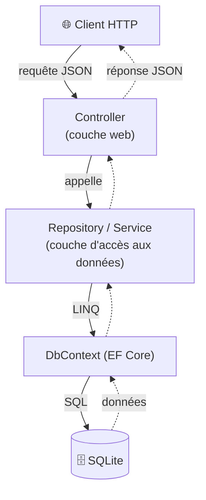
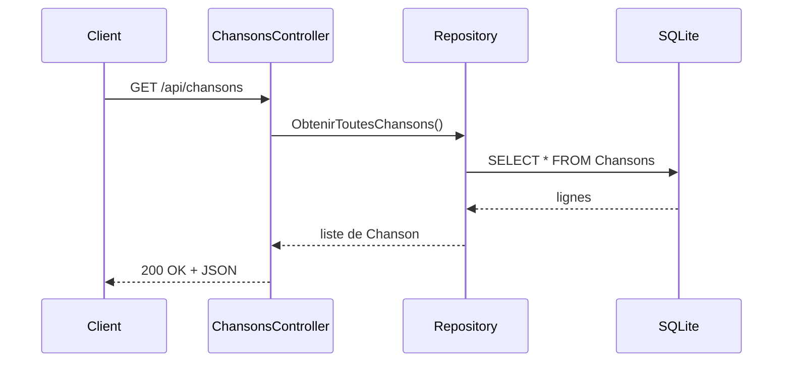

# 🏛️ Concept — L'architecture SOA en couches

> **TP concerné :** TP3 · **Temps de lecture :** 8 min

---

## 1. L'idée

**SOA** (*Service-Oriented Architecture*) organise le code en **couches** ayant chacune **une seule responsabilité**, qui communiquent par des contrats clairs.



- **Controller** : reçoit la requête, renvoie la réponse. Ne sait rien de la base.
- **Repository** : lit/écrit les données. Ne sait rien du web.

## 2. Le trajet d'une requête à travers les couches



## 3. Pourquoi séparer ?

> 🧠 **Couplage faible :** si on change de base de données, seul le Repository change ; le Controller ne bouge pas. Chaque couche évolue indépendamment, et on peut tester chacune isolément.

## 4. L'injection de dépendances

Le Controller ne **crée pas** ses dépendances ; ASP.NET Core les lui **fournit** automatiquement (le *conteneur d'injection*). En C# 14, via le constructeur primaire :
```csharp
public class ChansonsController(PlaylistContext ctx) : ControllerBase
```
> ⚙️ Le conteneur sait construire `PlaylistContext` (configuré dans `Program.cs`) et l'injecte à chaque requête. Cela rend le code **testable** : en test, on injecte une base InMemory à la place de SQLite.

---

## 🏛️ Le point de vue de l'architecte

**Enjeu :** séparer les responsabilités pour **tester, faire évoluer et remplacer** des morceaux indépendamment.

| ✅ Avantages | ⚠️ Inconvénients / limites |
|---|---|
| Couplage faible : changer la base n'impacte que le Repository | Plus de code et d'indirection |
| Testable couche par couche | Sur-découpage possible (couches inutiles) |
| Responsabilités claires | Appels en série → latence cumulée |

**Le choix :** le découpage en couches pour des applis **qui durent** ; éviter l'over-engineering sur un prototype.

## 5. Auto-évaluation

**Q1.** Quelle est la responsabilité du Controller ? du Repository ?
<details><summary>▸ Voir la réponse</summary>

Le **Controller** gère le web (recevoir la requête, renvoyer la réponse). Le **Repository** gère l'accès aux données (lire/écrire en base). Chacun ignore le rôle de l'autre.
</details>

**Q2.** Qu'est-ce que le « couplage faible » et pourquoi est-ce souhaitable ?
<details><summary>▸ Voir la réponse</summary>

Les couches dépendent le moins possible les unes des autres. Avantage : on peut en modifier une (ex. changer de base) **sans toucher** aux autres, et les tester séparément.
</details>

**Q3.** Qui fournit le contexte de données au Controller ?
<details><summary>▸ Voir la réponse</summary>

Le système d'**injection de dépendances** d'ASP.NET Core : il crée et passe automatiquement le `PlaylistContext` au constructeur du Controller.
</details>

---

✅ Cochez ce concept dans le [tableau de bord](https://ggaillard.github.io/playlist-csharp).
⬅️ [Retour aux concepts](README.md)
